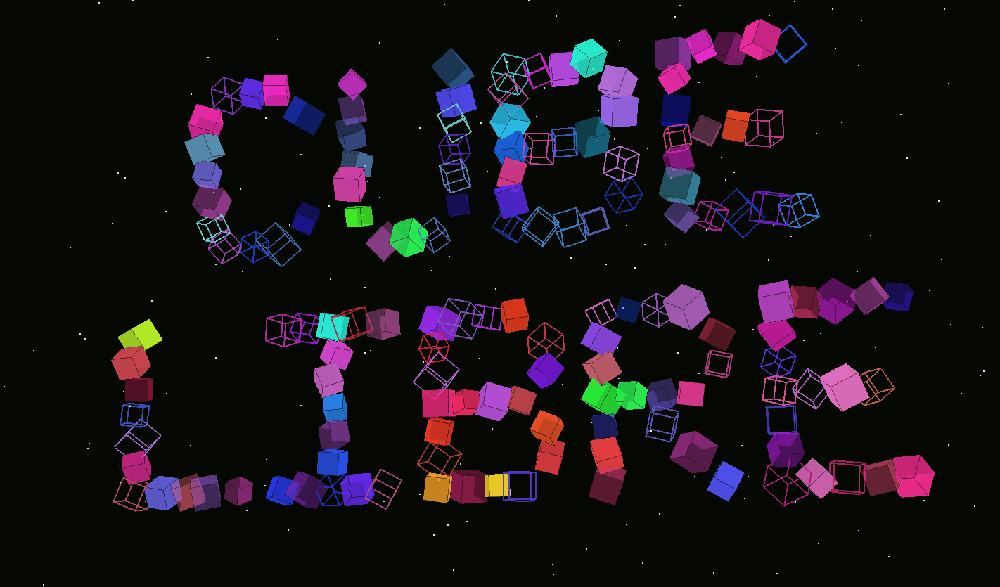
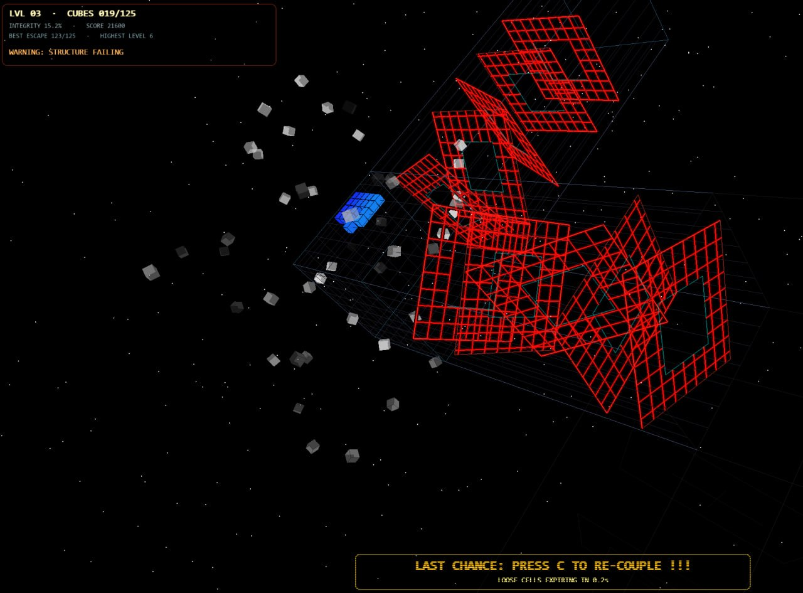
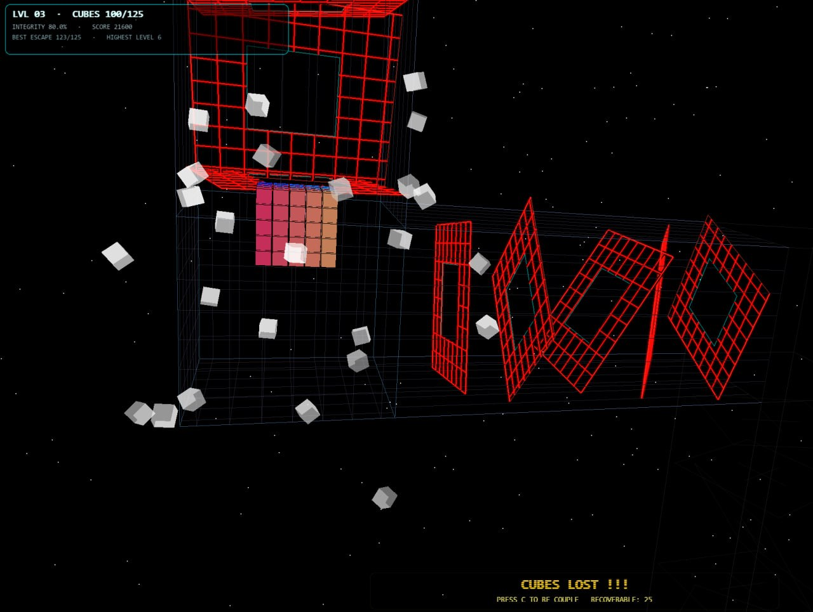
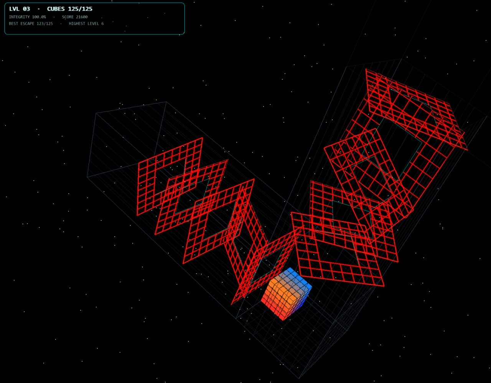

# Cube Libre



**Cube Libre** is a cubistic Pygame/OpenGL survival-puzzle prototype by **FlyingFathead**.

You control a cube made of smaller cubes. The cube is your body, health, cargo, score, and failure state. Rotating laser grids and boundary cages shear pieces away. Lost cubes can briefly be re-coupled, but recovery is lossy, time-limited, and rate-limited. The maze expands into modular pipe sections, collapses behind you, and eventually introduces time pressure.

This is still an experimental prototype, not a polished release. Expect weirdness, sudden design shifts, and some very deliberate hostility.



## Current concept

The player starts as a 5×5×5 cube, 125 smaller cubes total. Each surviving cube matters.

Core mechanics currently explored:

- rotating laser-grid obstacle fields
- modular tunnel / L-joint maze progression
- cube-body damage, fragmentation, and re-coupling
- time-limited recoverability of lost cubes
- lossy re-coupling gather rate
- portal commitment, requiring the remaining body to enter fully
- collapsing maze sections behind the player
- level-based progression and high-score tracking
- timed mode from later levels onward
- procedural audio, alarms, drones, buzzers, and portal sounds
- retro / Amiga-esque warning overlays

Still a WIP.

Longer-term design direction: some later gates may require the player to be damaged or reduced to fit through tight spaces. Staying whole is valuable, but being whole may not always be compatible with passage.

This game prototype is based on [my previous OpenGL cube demo tests from 2024](https://github.com/FlyingFathead/pygame-opengl-cube-demos/).



## Requirements

Install Python 3.10+ or newer, then install the Python dependencies:

```bash
pip install -r requirements.txt
```

Required packages:

```text
pygame
PyOpenGL
numpy
```

### First run note

On the first run, Cube Libre generates procedural audio assets into `cube_libre_sfx/`.
This can take a while on some systems, especially on Windows. Later runs reuse the generated files and should start faster.

To force regeneration, delete `cube_libre_sfx/`.

## Running

From the repository root:

```bash
python cube_libre_pygame.py
```

or:

```
./cube_libre_pygame.py
```

The game generates procedural sound files on first run under a local sound/effects directory. This first run may take slightly longer depending on the current prototype branch.



## Controls

| Key | Action |
| --- | --- |
| Space / Enter | Start / continue from title or result screens |
| A / D | Move along world X |
| W / S | Move along world Y |
| Q / E | Move along world Z |
| Ctrl + A / D | Alternate world-Z movement alias |
| Shift | Rush movement |
| C | Request re-coupling of recoverable lost cubes |
| P | Pause / resume |
| L | Toggle locate-camera / player-centered camera mode |
| H | Help overlay |
| M | Mute / unmute audio |
| F11 / Alt+Enter / Alt+F | Toggle fullscreen |
| Esc | Title / quit-confirm flow depending on current screen |

## Re-coupling

When cubes break off, they remain recoverable only briefly. Press **C** to request re-coupling.

Current tuning ideas include:

- recoverable fragment lifetime
- expiry blinking before permanent loss
- request cooldown / quota window
- lossy re-coupling gather rate, default around 90%
- later levels may reduce re-coupling generosity

Re-coupling is not meant to be a perfect undo button. It is a panic mechanic with consequences.

## Portal logic

The portal is not a simple touch-exit. The remaining intact cube mass must be committed into the portal. Partial entry causes portal charge, swirl, glow, and audio feedback. Transcendence only happens once the remaining intact body has entered properly.

## Level progression

Level 1 preserves the original straight tunnel concept. Later levels append modular pipe sections with L-joints. From later stages onward, old maze sections collapse behind the player and future sections may appear first as grey wireframe previews before hazards activate.

Timed mode begins in later levels, giving a fixed time budget per maze leg.

## Generated files

The prototype may create local runtime files such as:

```text
cube_libre_scores.json
cube_libre_sfx/
```

These should generally be ignored by Git unless intentionally committing generated assets.

## Suggested `.gitignore`

```gitignore
__pycache__/
*.pyc
.venv/
venv/
.env
cube_libre_scores.json
cube_libre_sfx/
.DS_Store
Thumbs.db
```

## Project status

This version is a living prototype. The code has grown fast and should eventually be split into modules:

```text
cube_libre/
  main.py
  config.py
  player.py
  levels.py
  collision.py
  render.py
  effects.py
  audio.py
  ui.py
```
etc.

The current priority is still design discovery: finding the core feel, mechanics, and audiovisual identity before hardening the architecture.

## Credits

**by FlyingFathead**  
<https://github.com/FlyingFathead>
w/ thanks to ChaosWhisperer
